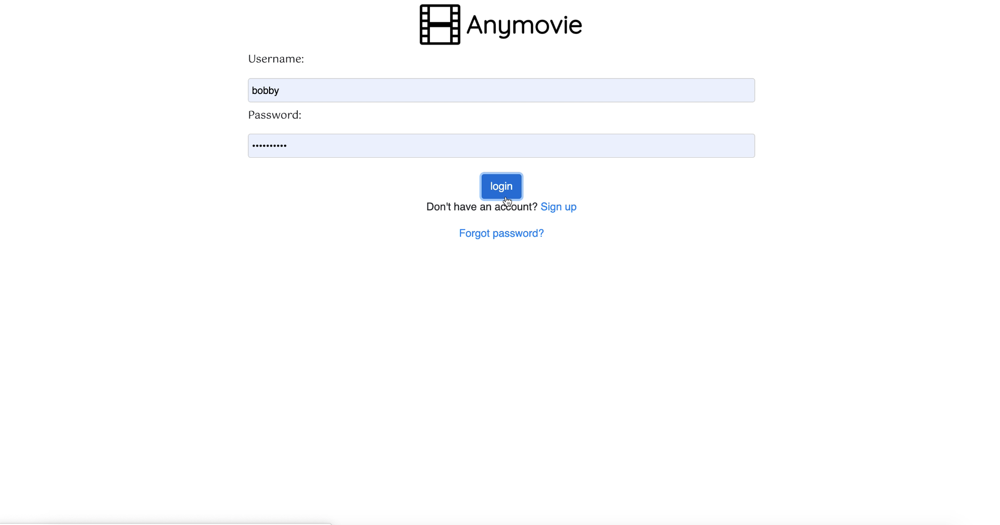
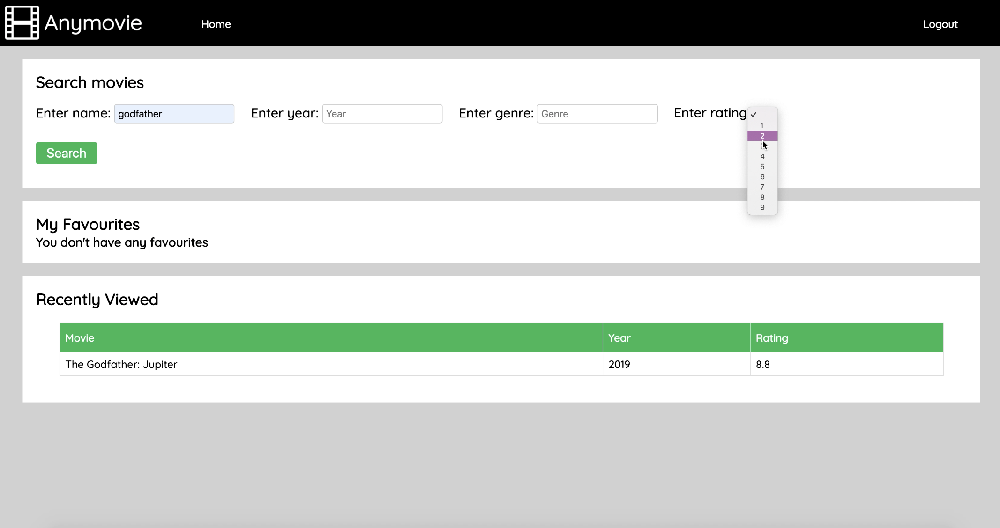
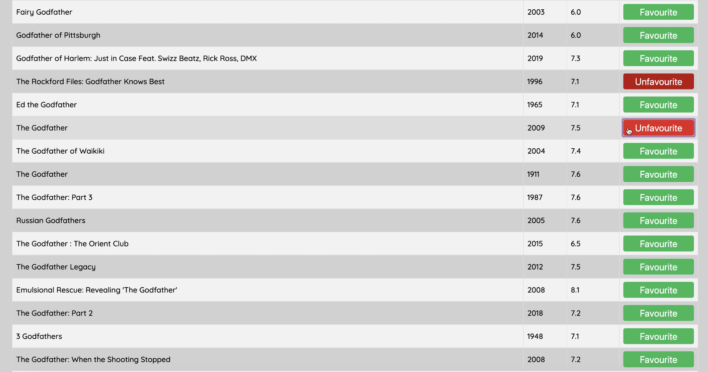
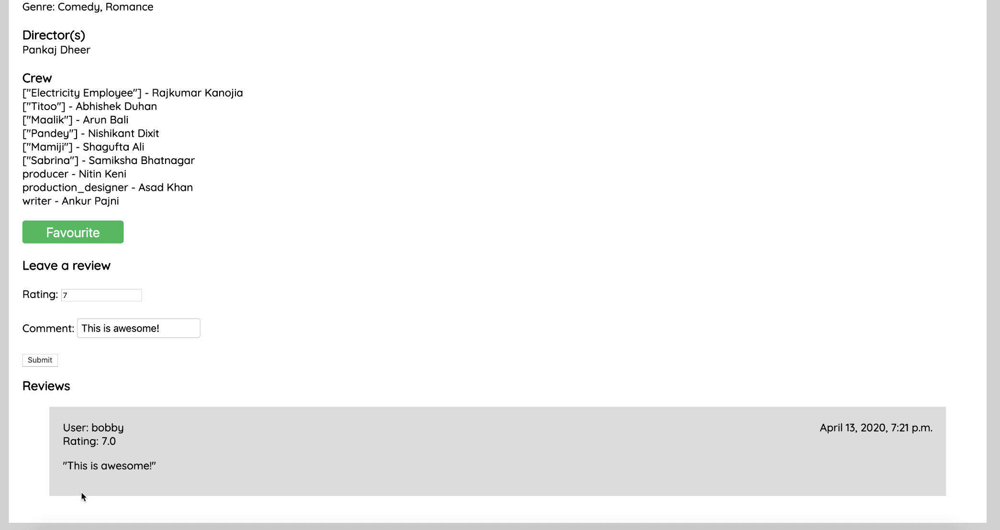
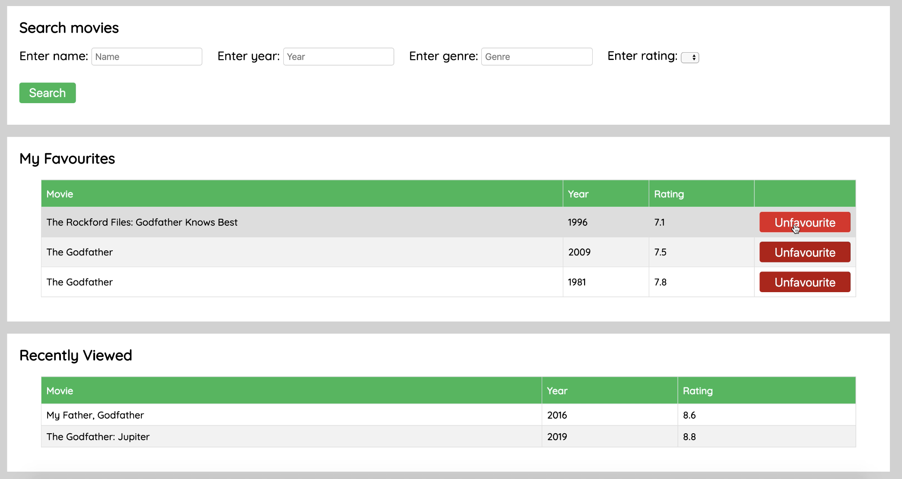

# Application Overview
This is a Django Application hosted on gcloud with postgres database. Currently the potgres instancce is not running.

# Application Features 
1) This Application is a CRUD Application, used to access information on a variety of Movies.
2) The purpose of this application is to give the user the ability to search for and contribute to large amounts of Movie information.
3) Users can find movies on a variety of filtering criteria and can also post personal comments on Movies.

Login Page

Main Screen

Filtered Data

Favorites:

Commenting

Main Updated Screen

